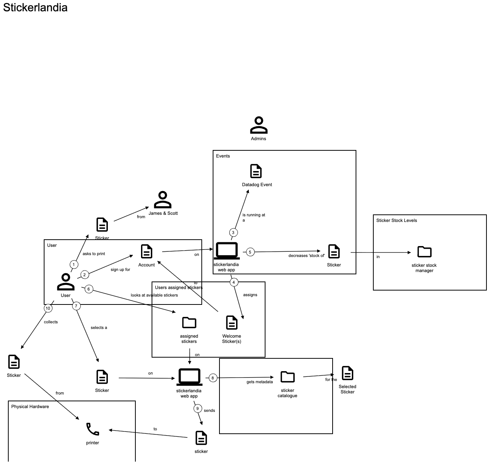

# Domain Storytelling

[Domain Storytelling](https://domainstorytelling.org/) is a technique to transform domain knowledge into effective business software. It brings together domain experts and development teams. The domain experts can see immediately whether you understand their story correctly.

