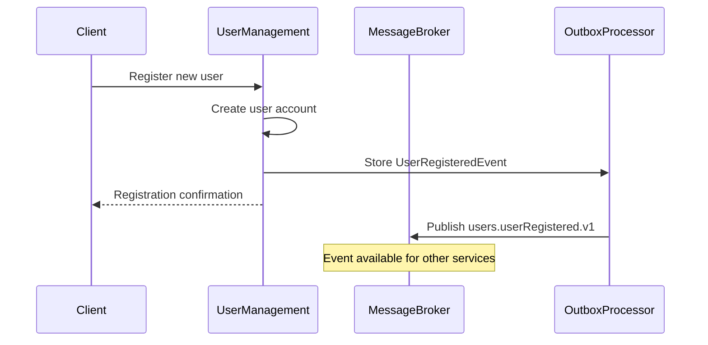
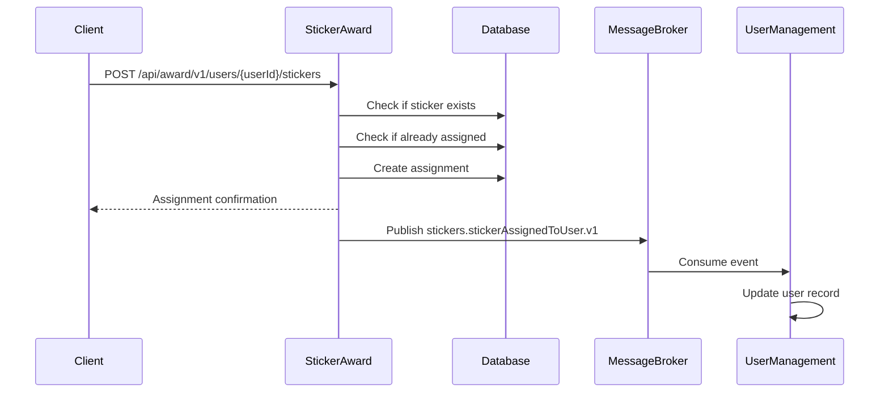
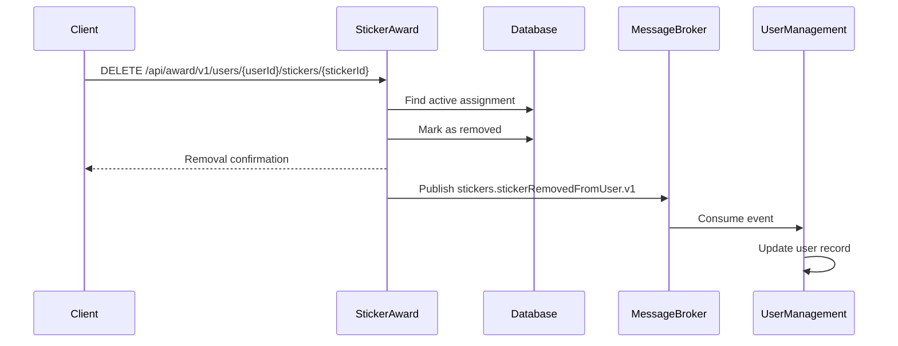
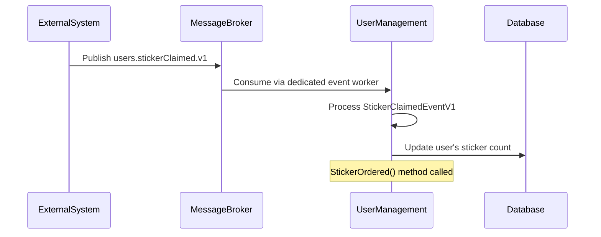
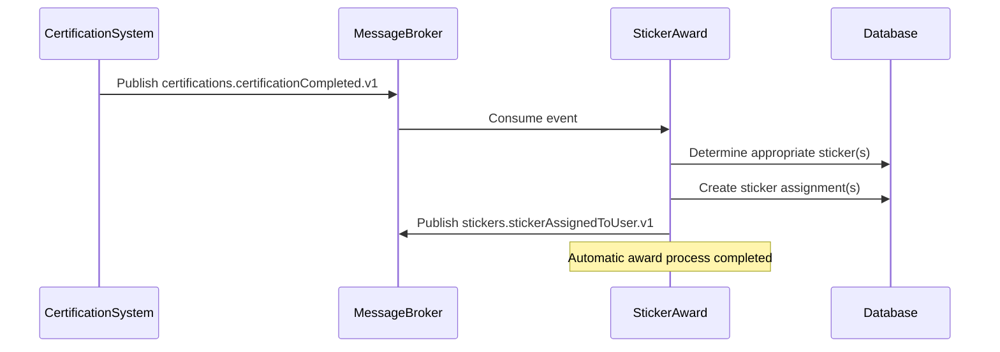

# Stickerlandia Event Flows

This document outlines the event flows between the different services in the Stickerlandia application.

## User Registration Flow

A user can either register directly with Stickerlandia, or login via a federated identity provider. We foresee this to be Datadog's own corporate directory and potentially one associated with our certification provider, so that we can tie external folks' identity up to their awards.

Note: We still need to implement a login interface to facilitate the federated identity integration. This is currently a TODO item for future development.

When a new user registers in the system, the User Management service publishes a user registration event. This flow ensures that other services are aware of new users in the system.

## Sticker Assignment

Stickers can be assigned through two primary mechanisms:
1. Via an admin UI, where administrators can manually award stickers to users
2. Via integration with certification systems, where the completion of certifications automatically triggers sticker awards (future state)

For the automatic assignment, another service will adapt external certification events to our internal event model and generate events that the sticker-award service listens to.
Note: This automatic assignment process corresponds to the [Sticker Claimed Flow](#sticker-claimed-flow) described below.

In all cases, the mapping from users to assigned stickers is managed by the sticker-award service.

When a sticker is assigned to a user, the Sticker Award service creates the assignment and notifies other services through events.

## Sticker Removal Flow

Sticker removal is primarily performed through the admin UI, allowing administrators to revoke previously assigned stickers when necessary.

When a sticker is removed from a user, the Sticker Award service updates the assignment status and notifies other services.

## Sticker Claimed Flow

This flow represents the scenario where users complete specific challenges or achievements in external systems. A service monitors these achievements and publishes events that inform our system about users qualifying for stickers.

When a user claims a sticker by completing a task or achievement, the event is processed to update the user's account.

## Certification Completion Flow

When a user completes a certification in an external system, the Sticker Award service can automatically assign appropriate stickers.

