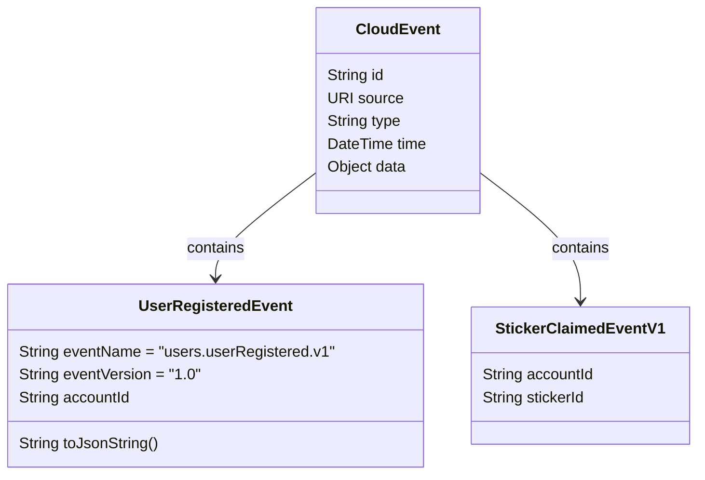

# Messaging Implementation in Stickerlandia

This document provides details about how the messaging infrastructure is implemented across Stickerlandia services.

## Messaging Technologies

Stickerlandia supports multiple messaging technologies for event-driven communication:

1. **Kafka** - Primary messaging system used for event distribution
1. **Azure Service Bus** - Used for Azure deployments
1. **AWS EventBridge** - Used for AWS deployments

## Event Structure

Events in Stickerlandia follow the CloudEvents specification, which provides a standardized way to describe event data.

