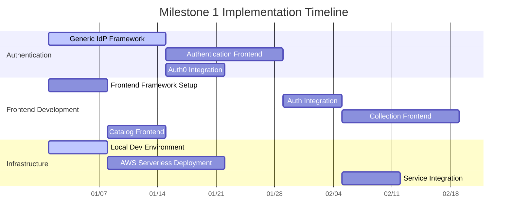
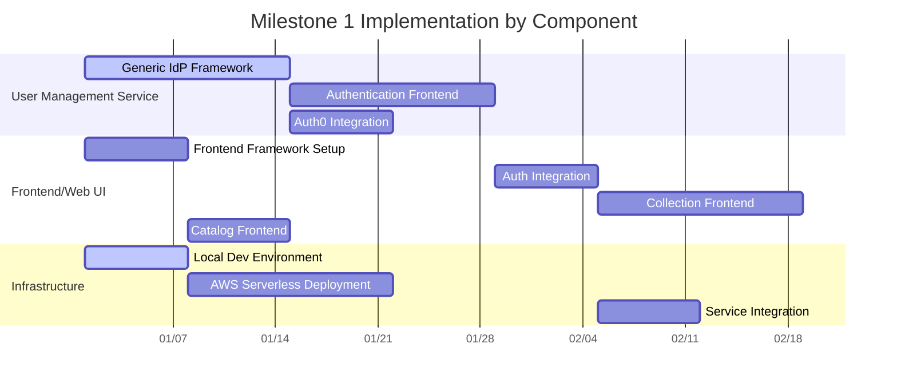

# Stickerlandia Implementation Tasks

Based on analysis of current codebase vs user stories. Organized by milestones with detailed tasks for Milestone 1 only.

## Milestones

### Milestone 1: Basic Functional MVP
**Goal:** Stickerlandia runs on AWS serverless and docker-compose. Users can login, see stickers assigned to them, and browse all available stickers.

**Scope:**
Features:
- User authentication with local users
- Basic sticker collection viewing
- Sticker catalog browsing

Targets:
- docker-compose
- AWS serverless deployment

### Milestone 2: Production Deployment (Future)
**Goal:** Stickerlandia deployed to its forever home on AWS with full production infrastructure.

**Scope:**
Same as **Milestone 1**, with all the extra rigmarole required to get a permanent deployment going on - CI/CD setup,
proper Datadog integration, proper AWS account. 

## Milestone 1 Tasks

**Status Legend:**
- ✅ Complete - Already implemented and working
- 🟡 Partial - Some components exist but needs completion
- 🔴 Missing - Not implemented, needs to be built

### Authentication & Identity

#### T001: Generic Identity Provider Framework 🟡
**Component:** User Management Service  
**Dependencies:** None  
**Status:** OpenIddict configured, needs generic IdP abstraction  
**Description:** Build extensible framework to support multiple identity providers (OIDC/SAML)  
**Current State:** JWT authentication working, needs IdP abstraction layer

#### T002: Authentication Frontend 🔴
**Component:** User Management Service  
**Dependencies:** T001  
**Status:** Not implemented  
**Description:** Build authentication UI/pages served by user management service  
**Current State:** Backend auth APIs exist, no auth UI

#### T003: Auth0 Integration (Test Implementation) 🔴
**Component:** User Management Service  
**Dependencies:** T001  
**Status:** Not implemented  
**Description:** Implement Auth0 as test identity provider to validate framework  
**Current State:** Framework needs to be built first

### Frontend Application

#### T004: Frontend Framework Setup 🔴
**Component:** Frontend/Web UI  
**Dependencies:** None  
**Status:** No frontend exists  
**Description:** Choose and setup frontend framework (React/Vue/Angular) with routing and basic layout  
**Current State:** Backend-only application

#### T005: Authentication Integration 🔴
**Component:** Frontend/Web UI  
**Dependencies:** T002, T004  
**Status:** Not implemented  
**Description:** Integrate frontend with user management service authentication  
**Current State:** No frontend auth integration

#### T006: Sticker Collection Frontend 🔴
**Component:** Frontend/Web UI  
**Dependencies:** T004, T005  
**Status:** No frontend exists  
**Description:** Build sticker gallery showing user's assigned stickers  
**Current State:** APIs exist, no web interface

#### T007: Sticker Catalog Frontend 🔴
**Component:** Frontend/Web UI  
**Dependencies:** T004  
**Status:** No frontend exists  
**Description:** Build sticker catalog showing all available stickers with details  
**Current State:** APIs exist, no web interface

### Infrastructure & Deployment

#### T008: Local Development Environment 🟡
**Component:** Infrastructure  
**Dependencies:** None  
**Status:** Docker Compose partially complete  
**Description:** Complete local development setup with all services and frontend  
**Current State:** Basic docker-compose exists, needs frontend integration

#### T009: AWS Serverless Deployment 🟡
**Component:** Infrastructure  
**Dependencies:** T004  
**Status:** CDK infrastructure exists, needs completion  
**Description:** Deploy to AWS using serverless architecture (ECS Fargate + RDS)  
**Current State:** Infrastructure code exists, needs frontend deployment

#### T010: Service Integration 🔴
**Component:** All Services  
**Dependencies:** T005  
**Status:** Services work independently  
**Description:** Ensure all services communicate properly with authentication flow  
**Current State:** Services exist but integration needs testing

---

## Implementation Timeline

## Component Timeline

## Summary

**Milestone 1 Scope:**
- **Completed:** 0 tasks  
- **Partial:** 3 tasks (Auth backend, docker-compose, AWS infrastructure)  
- **Missing:** 7 tasks (Frontend development, auth integration, deployment completion)

**Estimated Timeline:** 6-8 weeks

**Next Priority:** T004 (Frontend Framework) → T002 (Auth Frontend) → T005 (Auth Integration)

**Post-Milestone 1:** Advanced features like scheduled drops, social capabilities, certification integration, and production hardening will be planned for future milestones based on Milestone 1 learnings.
