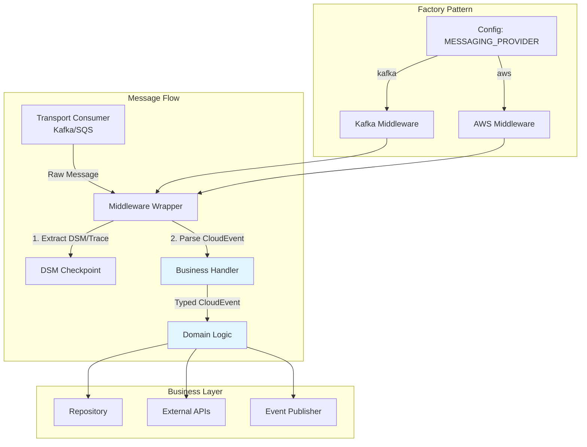

# Sticker Award Service

The Sticker Award Service manages sticker assignments to users in the Stickerlandia platform. It provides:

- **Assignment API** (`/api/awards/v1/assignments`) - User sticker assignment management (CRUD operations)  
- **Event Integration** - Publishes sticker assignment events as stickers are assigned, reacts to events elsewhere in the system (e.g., when a user is created)

## Architecture

### Design Principles

**Transport-Agnostic Messaging**: The service supports multiple messaging transports (Kafka, AWS EventBridge/SQS) via runtime configuration. Business handlers remain transport-agnostic by working only with CloudEvents - they never interact with Kafka or AWS-specific message formats.

**Middleware Pattern**: Message processing follows a consistent pipeline regardless of transport:
1. Transport layer receives raw message (Kafka `ConsumerMessage` or AWS `SQSMessage`)
2. Middleware wrapper extracts Datadog trace context and DSM checkpoints
3. Middleware parses CloudEvent from message body
4. Business handler receives typed `CloudEvent[T]` and executes domain logic

Steps 1-3 are provider specific, step 4 is generic across providers. 

**Factory Selection**: The handler factory selects the appropriate middleware implementation based on configuration (`MESSAGING_PROVIDER=kafka|aws`)



### Key Components

**Messaging Abstractions** (`internal/messaging/`)
- `EventPublisher` - Publishes domain events (Kafka or EventBridge)
- `MessageConsumer` - Consumes messages (Kafka consumer group or SQS)
- `CloudEventMessageHandler[T]` - Shared interface for business handlers
- `factory/` - Creates transport-specific consumers, producers, handlers

**Middleware** (`internal/messaging/{kafka,aws}/middleware.go`)
- Wraps business handlers with DSM tracking, tracing, CloudEvent parsing
- Creates root traces with span links for distributed tracing
- Injects Datadog headers for cross-service correlation

**Domain** (`internal/domain/`)
- Entities, repository interfaces, business rules
- No dependencies on transport or infrastructure

**Technology Stack**
- Go 1.23+, Gin, PostgreSQL, GORM, Viper
- Messaging: Kafka (sarama) or AWS SDK v2
- Datadog: dd-trace-go for APM and DSM
- CloudEvents 1.0 for event schema

## API Endpoints

### Assignment API (`/api/awards/v1/assignments`)
- `GET /api/awards/v1/assignments/{userId}` - Get user's sticker assignments
- `POST /api/awards/v1/assignments/{userId}` - Assign a sticker to a user
- `DELETE /api/awards/v1/assignments/{userId}/{stickerId}` - Remove sticker assignment

### System Endpoints
- `GET /health` - Health check with database connectivity

## API Documentation

Full API documentation is available in OpenAPI format:
- Synchronous API: [api.yaml](./docs/api.yaml)
- Asynchronous API: [async_api.json](./docs/async_api.json)

## Building and Running

### Prerequisites
- Go 1.23+
- PostgreSQL 15+
- Apache Kafka (for event publishing)
- Docker & Docker Compose (for local development)

### Development

Run the full development stack:
```bash
docker-compose up --build
```

Run locally (requires separate PostgreSQL):
```bash
make run
# or
go run ./cmd/server
```

### Testing

Run all unit tests:
```bash
make test
```

Run all tests, including integration tests:
```bash
make test-integration
```

Run tests with coverage:
```bash
make test-coverage
```

### Building

Build the application:
```bash
make build
```

Build Docker image:
```bash
make docker-build
```

## Code Quality

### Formatting and Linting
```bash
# Format code
make fmt

# Run linter
make lint
```

## Configuration

The service is configured via environment variables:

### Server Configuration
- `SERVER_PORT` - HTTP server port (default: 8080)

### Database Configuration
- `DATABASE_HOST` - Database host (default: localhost)
- `DATABASE_PORT` - Database port (default: 5432)
- `DATABASE_USER` - Database user (default: sticker_user)
- `DATABASE_PASSWORD` - Database password
- `DATABASE_NAME` - Database name (default: sticker_awards)
- `DATABASE_SSL_MODE` - SSL mode (default: disable)

### External Services
- `STICKER_CATALOGUE_BASE_URL` - Catalogue service URL

### Messaging Configuration
- `MESSAGING_PROVIDER` - Messaging transport (kafka or aws, default: kafka)

### Kafka Configuration (when MESSAGING_PROVIDER=kafka)
- `KAFKA_BROKERS` - Kafka broker addresses (comma-separated)
- `KAFKA_GROUP_ID` - Consumer group ID
- `KAFKA_PRODUCER_TIMEOUT` - Producer timeout in milliseconds (default: 5000)
- `KAFKA_PRODUCER_RETRIES` - Number of retry attempts (default: 3)
- `KAFKA_PRODUCER_BATCH_SIZE` - Batch size in bytes (default: 16384)
- `KAFKA_REQUIRE_ACKS` - Acknowledgment level (default: 1)
- `KAFKA_ENABLE_IDEMPOTENT` - Enable idempotent producer (default: true)

### AWS Configuration (when MESSAGING_PROVIDER=aws)
- `AWS_REGION` - AWS region (default: us-east-1)
- `AWS_EVENTBRIDGE_BUS_NAME` - EventBridge bus name (required)
- `AWS_SQS_QUEUE_URL` - SQS queue URL (required)
- `AWS_MAX_CONCURRENCY` - Max concurrent message processors (default: 10)
- `AWS_VISIBILITY_TIMEOUT` - SQS visibility timeout in seconds (default: 30)
- `AWS_WAIT_TIME_SECONDS` - SQS long polling duration in seconds (default: 20)
- AWS credentials via standard AWS SDK chain (environment variables, IAM role, etc.)

### Logging
- `LOG_LEVEL` - Log level (debug, info, warn, error)
- `LOG_FORMAT` - Log format (json, console)
