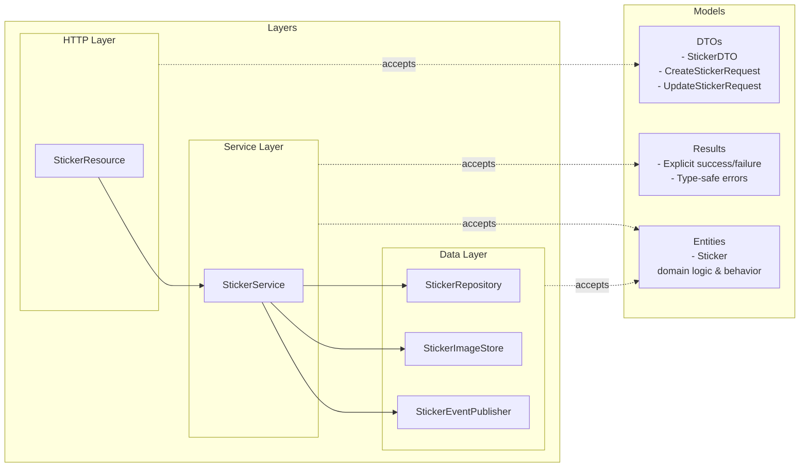

# Sticker Catalogue Service

The Sticker Catalogue Service manages stickers in the Stickerlandia platform. It stores both relational data
about the stickers, and the images of the stickers themselves. It is built on top of Quarkus, and uses the typical
quarkus extension points for the functionality it requires:

* **Panache** - to provide data access
* **

- **Catalog API** (`/api/stickers/v1`) - Manages the sticker catalog (metadata, images, CRUD)

## Architecture

### Domain Structure

- **`sticker/`** - Sticker catalog domain (`/api/stickers/v1`)
  - `StickerResource.java` - HTTP API for sticker catalog
  - `StickerRepository.java` - Data access and entity-DTO mapping
  - `dto/` - Request/Response DTOs (CreateStickerRequest, StickerDTO, etc.)
  - `entity/` - Database entities (Sticker)

- **`common/`** - Shared utilities
  - `dto/` - Common DTOs (PagedResponse)
  - `events/` - Domain events

### Separation of Concerns
#### Models

* **DTOs** are spoken by the Resources only 
* **Entities** are used both as the persistence model _and_ the domain model. 
This is an active decision to reduce needless mapping as we do not foresee significant
increase in domain complexity.

#### Layering

- **Resource** - HTTP layer, handles requests/responses, exposes **DTOs** in interface
- **Service** - Service layer, deals in the domain model (which happens to be our entity model) 
- **Repository** - Data layer, deals in the entity model

Here's a helpful diagram showing how the models and layering match up:



## API Endpoints

### Catalog API (`/api/stickers/v1`)
- `GET /api/stickers/v1` - List all stickers (paginated)
- `POST /api/stickers/v1` - Create new sticker
- `GET /api/stickers/v1/{stickerId}` - Get sticker metadata
- `PUT /api/stickers/v1/{stickerId}` - Update sticker metadata
- `DELETE /api/stickers/v1/{stickerId}` - Delete sticker
- `GET /api/stickers/v1/{stickerId}/image` - Get sticker image
- `PUT /api/stickers/v1/{stickerId}/image` - Upload/update sticker image

## Error Handling

The API returns standard HTTP status codes and follows the RFC 7807 Problem Details specification for error responses.

## API Documentation

Full API documentation is available in OpenAPI format:
- Synchronous API: [api.yaml](./docs/api.yaml)
- Asynchronous API: [async_api.json](./docs/async_api.json)

## Building and Running

### Prerequisites
- Java 21+
- Maven 3.8+

### Development

Run in development mode:
```bash
./mvnw compile quarkus:dev
```

### Testing

Run tests:
```bash
./mvnw test
```

Run integration tests:
```bash
./mvnw verify
```

## Code Quality

This project enforces high code quality through multiple static analysis tools:

### Error Prone

This project uses Error Prone to catch common Java programming mistakes at compile time.

**Error Prone Integration:**
- Runs automatically during compilation (`./mvnw compile`)
- Catches bugs like incorrect Date usage, unused variables, and charset issues
- Configured in the Maven compiler plugin
- Uses Error Prone version 2.38.0

**Common Error Prone checks include:**
- `JavaUtilDate` - Flags usage of legacy `java.util.Date` API
- `UnusedVariable` - Detects unused fields and variables
- `DefaultCharset` - Warns about implicit charset usage in string operations

### Checkstyle

This project uses Checkstyle to enforce coding standards based on the Google Java Style Guide.

**Run Checkstyle validation:**
```bash
# Check code style (runs automatically during build)
./mvnw validate

# Run only Checkstyle check
./mvnw checkstyle:check

# Generate Checkstyle report (creates HTML report at target/reports/checkstyle.html)
./mvnw checkstyle:checkstyle
```

### Spotless (Code Formatting)

This project uses Spotless with Google Java Format to automatically fix code style issues. 

**Format your code:**
```bash
# Check if code formatting is correct
./mvnw spotless:check

# Automatically fix code formatting issues
./mvnw spotless:apply

# Format and then validate with Checkstyle
./mvnw spotless:apply validate
```
