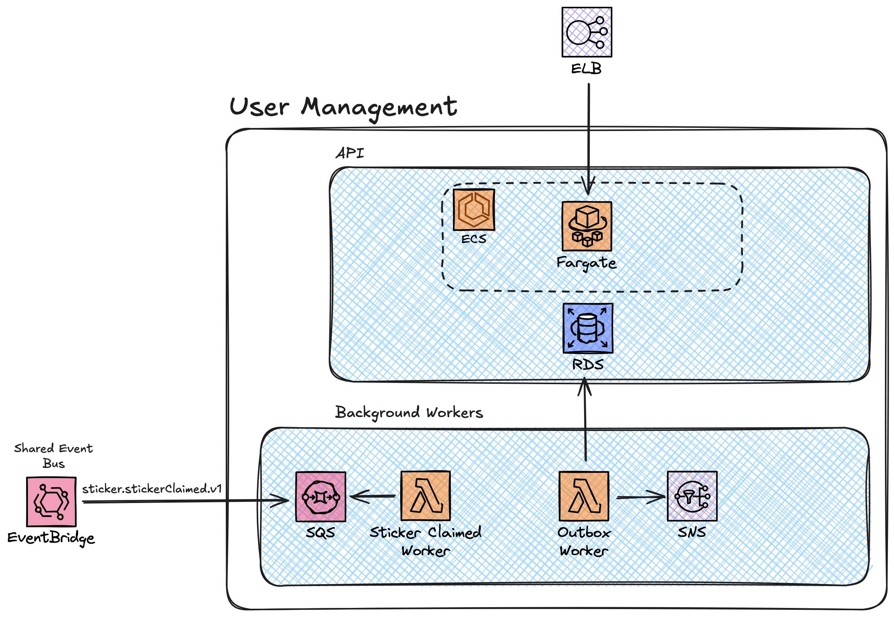

# User Management Service

The User Management Service manages users. It provides one primary API:

- **User Management API** (`/api/users/v1`) - Manages users and provides OAuth 2.0 endpoints for AuthN/Z

## Architecture

### Separation of Concerns

The project follows a ports and adapters architecture style, split down into `Driving` and `Driven` adapters, as well as a `Core` library.

- **Stickerlandia.UserManagement.Agnostic** - Driven adapters for Agnostic services
- **Stickerlandia.UserManagement.AWS** - Driven adapters for AWS native services
- **Stickerlandia.UserManagement.Azure** - Driven adapters for Azure native services

- **Stickerlandia.UserManagement.Api** - Driving adapters for a containerized ASP.NET minimal API
- **Stickerlandia.UserManagement.Worker** - A seperate background worker service for agnostic background workers
- **Stickerlandia.UserManagement.FunctionApp** - Driving adapters for a Azure function app background workers
- **Stickerlandia.UserManagement.Lambda** - Driving adapters for AWS Lambda background workers

- **Stickerlandia.UserManagement.Core** - Core library for domain services
- **Stickerlandia.UserManagement.Auth** - Core library for auth concerns using [OpenIddict](https://documentation.openiddict.com/)


### AWS Architecture



The AWS native implementation of the user management service uses a combination of containers and functions as a service (FaaS), as well as native messaging services. The different components on this diagram tie to specific classes in the AWS CDK IaC project:

- [API](./infra/aws/lib/api.ts)
    - Amazon ECS for container orchestration, with Fargate providing the underlying compute
    - A traditional Postgres database, for use with the [OpenIddict](https://documentation.openiddict.com/) auth libraries
- [Background Workers](./infra/aws/lib/background-workers.ts)
    - AWS Lambda for the compute, both handling external events and running on a schedule to process items from the outbox
    - Rules are defined on a shared external Amazon Event Bridge event bus
    - Amazon SQS provides durability at the boundaries of the system
    - Internal domian events are published to Amazon SNS
- [Shared](./infra/aws/lib/sharedResources.ts)
    - Currently, these are manually created. Eventually these will be created in an external stack and this construct will pull from 

## API Endpoints

### User Management API (`/api/users/v1`)

You can find the full [Open API specification in the docs folder](./docs/api.yaml).

## Features

- Register users
- OIDC authorization code flow (frontend app) and client credentials flow (service->service) 
- Get and update user accounts

## Events

You can find the full [Async API specification for events published and received in the docs folder](./docs/async_api.yaml)

## Authentication

All API endpoints (except `/health` and `/register`) require authentication via JWT token in the Authorization header. 
Access controls ensure users can only operate on their own accounts unless they have admin privileges.

## Error Handling

The API returns standard HTTP status codes and follows the RFC 7807 Problem Details specification for error responses.

## Building and Running

### Prerequisites
- .NET 8.0
- .NET Aspire

### Development

One of the core principles of Stickerlandia is **platform adaptability** by design. That means the user service can run on Azure, AWS or any cloud agnostic container orchestrator. When developing locally, you can use [.NET Aspire](https://learn.microsoft.com/en-us/dotnet/aspire/get-started/aspire-overview) to run and debug the application locally whichever stack you want to deploy against. The .NET Aspire project has different launch profiles for each of the different hosting models.

Run with Agnostic services *(Kafka, Postgres)*:
```bash
cd src/Stickerlandia.UserManagement.Aspire
dotnet run -lp agnostic
```

Run with Azure services *(Azure Functions, Azure Service Bus, Postgres)*:
```bash
cd src/Stickerlandia.UserManagement.Aspire
dotnet run -lp azure_native
```

Run with AWS services *(AWS Lambda, Amazon SNS, Aamzon SQS, Postgres)*:
```bash
cd src/Stickerlandia.UserManagement.Aspire
dotnet run -lp aws_native
```

### Testing

Run unit tests:
```bash
cd tests/Stickerlandia.UserManagement.UnitTest
dotnet test
```

The integration tests use [.NET Aspire testing support](https://learn.microsoft.com/en-us/dotnet/aspire/testing/write-your-first-test?pivots=xunit). This enables you to run full integration tests for each of the individual hosting models. To run the tests, you need to set the `DRIVING` and `DRIVEN` environment variables.

Run Agnostic integration tests:
```bash
cd tests/Stickerlandia.UserManagement.IntegrationTest
export DRIVING=AGNOSTIC
export DRIVEN=AGNOSTIC
dotnet test
```

Run Azure integration tests:
```bash
cd tests/Stickerlandia.UserManagement.IntegrationTest
export DRIVING=AZURE
export DRIVEN=AZURE
dotnet test
```

Run AWS integration tests:
```bash
cd tests/Stickerlandia.UserManagement.IntegrationTest
export DRIVING=AWS
export DRIVEN=AWS
dotnet test
```

## Code Quality

This project enforces high code quality through the use of static analysis tools:

.NET has built-in Roslyn analyzers that inspect your C# code for code style and quality issues. To enforce these styles, a [`Directory.build.props`](./Directory.build.props) file is included in the repository root that turns on all static analysis tools.
