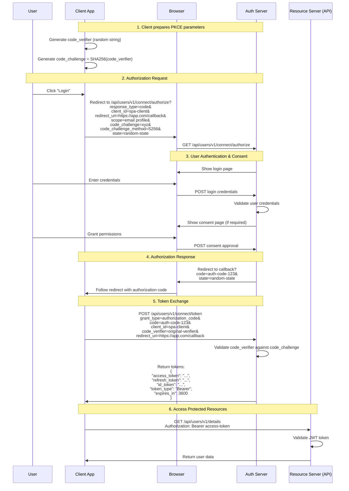
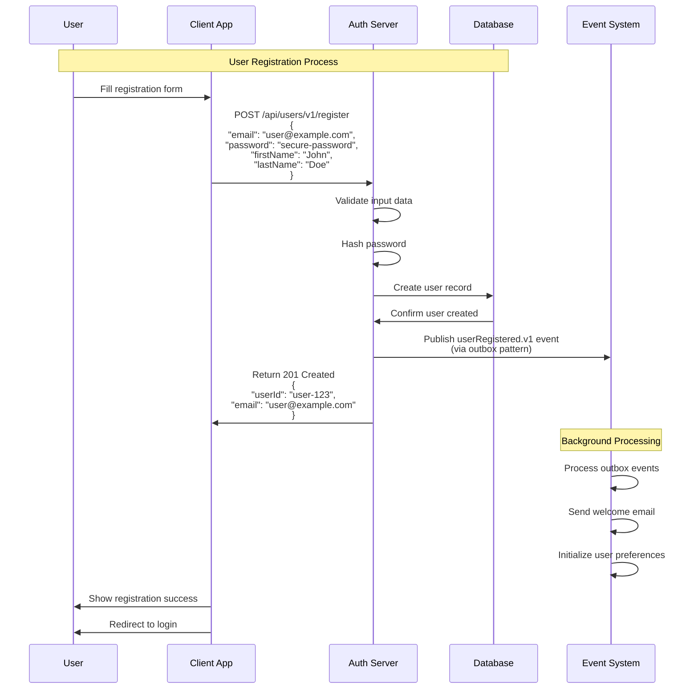
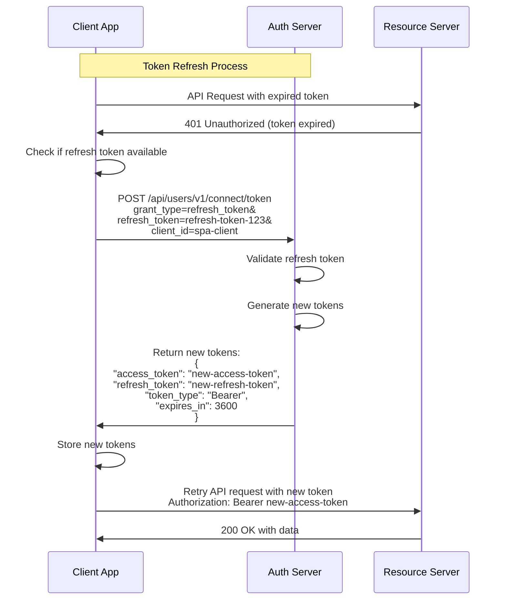
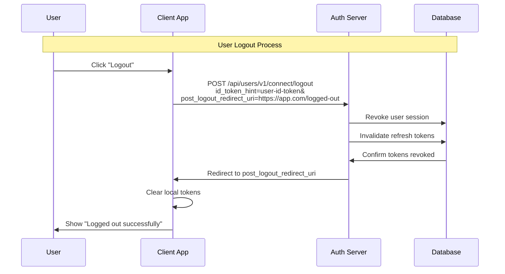

# Authentication Guide

This document provides comprehensive guidance on the OAuth 2.0 authentication flows supported by the Stickerlandia User Management Service.

## Overview

The Stickerlandia User Management Service implements a complete OAuth 2.0 authorization server using [OpenIddict](https://documentation.openiddict.com/), integrated with ASP.NET Core Identity for robust user management.

### Key Components
- **Authorization Server**: OpenIddict-based OAuth 2.0 implementation
- **Identity Provider**: ASP.NET Core Identity with PostgreSQL storage
- **User Model**: Custom `PostgresUserAccount` extending `IdentityUser`
- **Security**: PKCE (Proof Key for Code Exchange) for enhanced security

## OAuth 2.0 Endpoints

The service exposes standard OAuth 2.0 endpoints:

| Endpoint | URL | Purpose |
|----------|-----|---------|
| Authorization | `/api/users/v1/connect/authorize` | Initiate OAuth authorization flow |
| Token | `/api/users/v1/connect/token` | Exchange authorization codes for tokens |
| UserInfo | `/api/users/v1/connect/userinfo` | Retrieve user information using access token |
| Logout | `/api/users/v1/connect/logout` | End user session |

## Supported Authentication Flows

### ✅ Authorization Code Flow with PKCE

**Primary flow for client applications** - Recommended for SPAs, mobile apps, and web applications.

**Features:**
- Enhanced security with PKCE (Proof Key for Code Exchange)
- Suitable for public clients (SPAs, mobile apps)
- Supports refresh tokens for seamless user experience
- Implements OpenID Connect for user identity

**Scopes Supported:**
- `email` - Access to user email address
- `profile` - Access to user profile information (name, account details)
- `roles` - Access to user roles and permissions

### ✅ Refresh Token Flow

**Token refresh capability** - Extends user sessions without re-authentication.

**Features:**
- Seamless token refresh without user interaction
- Configurable token lifetimes
- Automatic token rotation for enhanced security

### ❌ Client Credentials Flow

**Not Currently Implemented** - Service-to-service authentication can be implemented at a later date once service to service communication is required.

### ❌ Other Flows

The following OAuth 2.0 flows are **not supported** for security reasons:
- **Implicit Flow** - Deprecated due to security vulnerabilities
- **Resource Owner Password Credentials Flow** - Not recommended for modern applications

## Authentication Flow Diagrams

### Authorization Code Flow with PKCE

### User Registration Flow

### Token Refresh Flow

### Logout Flow

