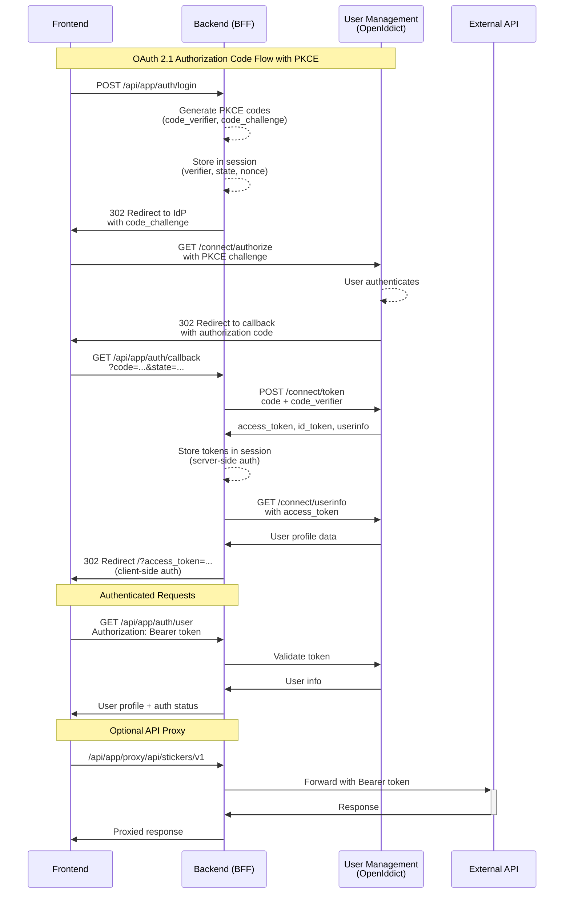

# Backend (BFF)

Backend for Frontend service that handles OAuth 2.1 authentication using OpenID Connect and provides API proxying for authenticated requests.

This BFF implements OAuth 2.1 authorization code flow with PKCE against the user-management service. It maintains both server-side sessions (cookies) and returns access tokens to the client for hybrid authentication support. As it stands we're allowing the client to call through to the APIs directly itself, and not doing much with the server side session. In the future we might decide that we don't want the client to ever see the token, and then we would change this here.

## Authentication Flow

## API Endpoints

### Authentication
- `POST /api/app/auth/login` - Initiate OAuth flow
- `GET /api/app/auth/callback` - OAuth callback handler  
- `GET /api/app/auth/user` - Get current user (supports Bearer token)
- `POST /api/app/auth/logout` - Clear session and logout

### Proxy (Optional)
- `/api/app/proxy/*` - Proxy authenticated requests to backend services. **Note**: We're not using this for now!

## Environment Variables

| Variable | Purpose | Default |
|----------|---------|---------|
| `OAUTH_ISSUER_INTERNAL` | URL used for server-side OIDC operations (discovery, token exchange, JWKS, userinfo) | `http://user-management:8080` |
| `OAUTH_CLIENT_ID` | OAuth client identifier registered with the IdP | `web-ui` |
| `OAUTH_CLIENT_SECRET` | OAuth client secret | `stickerlandia-web-ui-secret-2025` |
| `DEPLOYMENT_HOST_URL` | Public-facing URL used to construct OAuth redirect URIs | `http://localhost:8080` |
| `SESSION_SECRET` | Secret for Express session encryption | `dev-session-secret-change-in-production` |
| `CSRF_SECRET` | Secret for CSRF token protection | `dev-csrf-secret-change-in-production` |
| `NODE_ENV` | Environment mode; controls cookie security and rate limiting | `development` |
| `SKIP_RATE_LIMIT` | Set to `true` to bypass login rate limiting (development only) | unset |

### OIDC Internal/External URL Handling

The BFF needs to handle two different URL contexts for OIDC:

1. **Server-side operations** (token exchange, JWKS fetch, userinfo calls) - these use `OAUTH_ISSUER_INTERNAL`
2. **Browser redirects** (OAuth callback) - these use `DEPLOYMENT_HOST_URL`

In **Docker Compose**, these differ because the backend reaches the IdP via Docker's internal DNS (`http://user-management:8080`), while browsers access everything through Traefik at `http://localhost:8080`.

In **AWS**, both are set to the same CloudFront distribution URL since there's no internal Docker network - all traffic routes through CloudFront.

The `OAUTH_ISSUER_INTERNAL` variable allows overriding the endpoints discovered from the IdP's `.well-known/openid-configuration`. This is necessary because the IdP advertises its external URL (from its own `OPENIDDICT_ISSUER` setting), but server-to-server calls need to use internal networking.